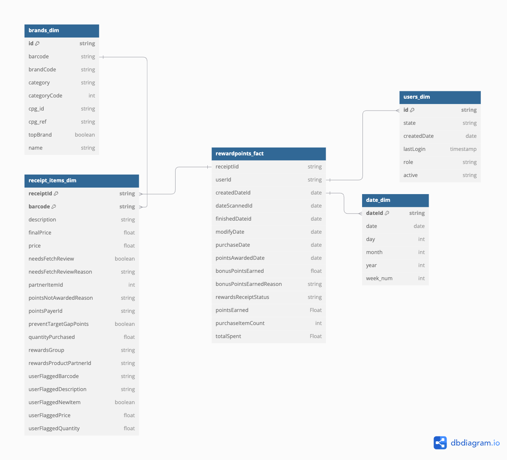

# **Fetch Rewards Data Assessment**
This repository contains the **data modeling, SQL queries, data quality evaluation, and stakeholder communication** for the Fetch Rewards data assessment.

---

## **📌 1️⃣ Review & Model the Data**
### **Understanding the Data**
The provided dataset consists of **three JSON files**:
- **`users.json`** – Contains user account information.
- **`brands.json`** – Stores brand details and barcode information.
- **`receipts.json`** – Includes transactional details of scanned receipts.

### **Relational Data Model**
A structured relational model was created to optimize querying. Below is the **Entity Relationship Diagram (ERD):**

<p align="center">
    
</p>

### **Schema Overview**
| Table | Primary Key | Foreign Keys | Description |
|--------|------------|--------------|-------------|
| `users_dim` | `id` | None | Stores user information (state, sign-up details, last login) |
| `brands_dim` | `id` | None | Stores brand-related information (barcode, category, name) |
| `rewardpoints_fact` | `receiptId` | `userId` (users_dim) | Stores transactional data for receipts, including total spent and rewards status |
| `receipt_items_dim` | `receiptId`, `barcode` | `receiptId` (rewardpoints_fact), `barcode` (brands_dim) | Stores receipt item-level details |
| `date_dim` | `dateId` | None | Stores date information for efficient time-based analysis |

### **Data Model Justification**
- **Fact-Dimension Modeling**: Transactions (`rewardpoints_fact`) are stored separately from users (`users_dim`) and brands (`brands_dim`) for efficient querying.
- **Date Dimension (`date_dim`)**: Allows for time-based analytics.
- **Normalization**: Avoids redundant data storage.

---

## **📌 2️⃣ SQL Queries for Business Questions**
Below are queries designed to answer key business questions.
### **Query 1: When considering average spend from receipts with 'rewardsReceiptStatus’ of ‘Accepted’ or ‘Rejected’, which is greater?**
```sql
    SELECT 
        rewards_receipt_status,
        AVG(total_spent) AS avg_spend
    FROM receipts_fact
    WHERE rewards_receipt_status IN ('ACCEPTED', 'REJECTED', 'FINISHED')
    GROUP BY rewards_receipt_status;
```

### **Query 2: When considering total number of items purchased from receipts with 'rewardsReceiptStatus’ of ‘Accepted’ or ‘Rejected’, which is greater?**
```sql
    SELECT 
        r.rewards_receipt_status,
        SUM(r.purchased_item_count ) AS total_items
    FROM receipts_fact r
    WHERE r.rewards_receipt_status IN ('ACCEPTED', 'REJECTED', 'FINISHED')
    GROUP BY r.rewards_receipt_status
```

## 📌 3️⃣ Data Quality Issues & Solutions

### **Identified Data Quality Issues**

| **Issue Type**            | **Dataset**           | **Problem**                                             |
|---------------------------|----------------------|--------------------------------------------------------|
| **Missing Values**        | `users.json`         | `state`, `signUpSource`, `lastLogin` are missing in many records |
| **Duplicate Records**     | `users.json`         | `_id` field has duplicates                            |
| **Inconsistent Data Types** | `receipts.json`  | `purchaseDate` and `createDate` stored as string instead of datetime |
| **Outliers**             | `receipts.json`      | `totalSpent` contains extreme values                  |
| **Referential Integrity** | `receipts.json & users.json` | `userId` in receipts does not always exist in users |

---

### **Potential Resolutions (To Be Discussed with Business)**
- **Missing Values:** Should we **impute missing values** or exclude records where key attributes (e.g., `state`, `signUpSource`) are missing?
- **Duplicate Records:** Should duplicates be **merged, flagged, or removed**? What criteria should determine uniqueness?
- **Inconsistent Data Types:** Can we safely **convert `purchaseDate` and `createDate` to `DATETIME`**, or do some records need manual review?
- **Outliers:** Should we remove receipts with **extremely high `totalSpent` values**, or do they represent valid business scenarios?
- **Referential Integrity:** How should we handle **orphaned receipts** where `userId` is missing from `users.json`?

---

### **Next Steps**
- Discuss data quality issues and potential resolutions with business stakeholders.
- Implement appropriate fixes based on business priorities.
- Validate changes before integrating them into reporting and analytics.

## 📂 Repository Structure
```
├── data/
│   ├── brands.json
│   ├── receipts.json
│   ├── users.json
├── fetch-analytics/
│   ├── fetch_analytics_datamodel.png
│   ├── utils.py
│   ├── fetch_rewards_assessment.ipynb
│   ├── fetch_rewards.db
│   ├── pyproject.toml
│   ├── stakeholder_email.pdf
│   ├── uv.lock
├── README.md
```
